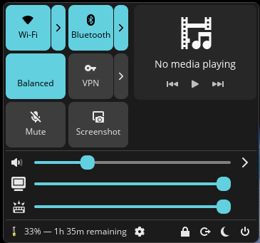

# Singularity

**Unified Quick-Settings Applet for the COSMIC Desktop Environment**

Singularity is a comprehensive control center designed exclusively for COSMIC. It consolidates essential system controls—audio, network, power, bluetooth, and media playback—into a unified interface.

Built with Rust and `libcosmic`, Singularity integrates directly with native Linux system services to provide a responsive and cohesive user experience tailored for the COSMIC ecosystem.



## Why Singularity?

The default COSMIC experience provides separate applets for network, audio, and battery. While modular, this can sometimes lead to a cluttered panel. Singularity takes a unified approach similar to mobile operating systems or other modern desktop environments:

- **Efficiency**: Access all critical toggles in a single click.
- **Aesthetics**: A cohesive design that looks great on your desktop.
- **Performance**: Written in Rust for near-instant startup and low memory usage.

## Features

### Network Management
Powered by NetworkManager, Singularity provides quick access to connectivity settings:
- Toggle Wi-Fi status.
- Connect to known networks.
- Activate VPN connections.
- Direct links to full system network settings.

### Audio Control
Advanced audio management via PipeWire integration:
- Adjust system volume.
- Quick mute/unmute toggles.
- Switch dynamically between available audio output and input devices.
- Synchronization with WirePlumber and standard PipeWire configurations.

### Media Playback
MPRIS support enables control over active media players (e.g., Spotify, Firefox, VLC):
- View current track information (Title, Artist).
- Playback controls: Play, Pause, Next, Previous.

### Bluetooth
Integrated with BlueZ for wireless device management:
- Toggle Bluetooth power state.
- View status of connected devices.

### Power Management
Comprehensive power controls supporting both `systemd-logind` and `elogind`:
- **Performance Profiles**: Switch between Balanced, Performance, and Power-Saver modes.
- **System Actions**: Lock screen, Suspend, Power Off, Reboot, and Log Out.
- **Battery Monitoring**: View battery percentage and status via UPower.

### Hardware Controls
- **Display**: Adjust screen brightness.
- **Keyboard**: Adjust keyboard backlight intensity.

### Adaptive Interface
The interface automatically adapts to the host hardware. Controls for missing features—such as battery status on desktops or keyboard backlights on unsupported devices—are automatically hidden to maintain a clean layout.

## Installation

### Prerequisites

To build and run Singularity, ensure the following tools and services are available on your system:

**Build Tools:**
- `rust` and `cargo` (Latest stable toolchain)
- `just` (Command runner)
- `git`

**Runtime Dependencies:**
- COSMIC Desktop Environment (libcosmic)
- NetworkManager
- UPower
- BlueZ
- PipeWire
- systemd-logind OR elogind

### Building from Source

1. **Clone the repository:**
   ```bash
   git clone https://github.com/sreevikramr/singularity.git
   cd singularity
   ```

2. **Build the release binary:**
   ```bash
   just build-release
   ```

3. **Install to the system:**
   This command installs the binary to `/usr/bin`, and the necessary desktop entry and icons to `/usr/share`.
   ```bash
   sudo just install
   ```

### Uninstalling

To remove Singularity from your system:

```bash
sudo just uninstall
```

## Usage

### Adding to the COSMIC Panel

Once installed, you must manually add the applet to your panel:

1. Right-click anywhere on an existing COSMIC panel.
2. Select **Panel Settings**.
3. Navigate to the **Applets** section.
4. Click **Add Applet**.
5. Select **Singularity** from the list.

### Configuration

Singularity currently relies on system-wide configuration for services (NetworkManager, BlueZ, etc.). Specific applet preferences are planned for future releases.

## Roadmap

We are actively working on the following features to reach version 1.0:

- [ ] **Customizability**: Allow users to reorder or hide specific modules within the applet.
- [ ] **Keyboard Navigation**: Full support for navigating the interface using arrow keys and shortcuts.
- [ ] **Localization**: Translations for major languages.
- [ ] **Notifications**: Integration with the notification daemon for critical alerts (e.g., low battery).
- [ ] **Do Not Disturb**: Quick toggle to silence notifications.
- [ ] **Theme Support**: Better integration with custom COSMIC themes beyond the default system colors.

## Development

This project uses `just` to manage development tasks.

- **Run locally**: Builds and runs the applet in a standalone window for testing.
  ```bash
  just run
  ```

- **Linting**: Checks code against project standards using `clippy`.
  ```bash
  just check
  ```

- **Clean**: Removes build artifacts.
  ```bash
  just clean
  ```

## License

This project is licensed under the **GPL-3.0 License**. See the `LICENSE` file for details.
